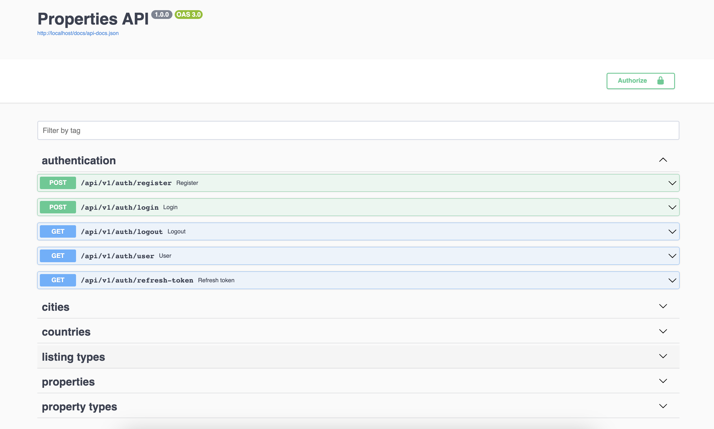

## Properties SPA Project: API side - work in progress...

Technologies used in the project:

- Laravel 10 
- PHP8.2

## How to use it

1. Install Docker
2. Run `sail up -d`
3. Run `sail composer install`
4. Run `sail artisan migrate:fresh --seed`

### API documentation 

Go to http://localhost/api/documentation#/

### PHPUnit

Run `sail test`

### Screenshot

## License

Copyright (C) Eduard Cristian Robu - All Rights Reserved

This file is part of Properties project

Properties project can not be distributed without the express permission of Eduard Cristian Robu

Written by Eduard Cristian Robu <robu.edi.office at gmail.com>, 2023

Eduard Cristian Robu works as a contractor, for any enquiries please contact using the <robu.edi.office at gmail.com> email address 

